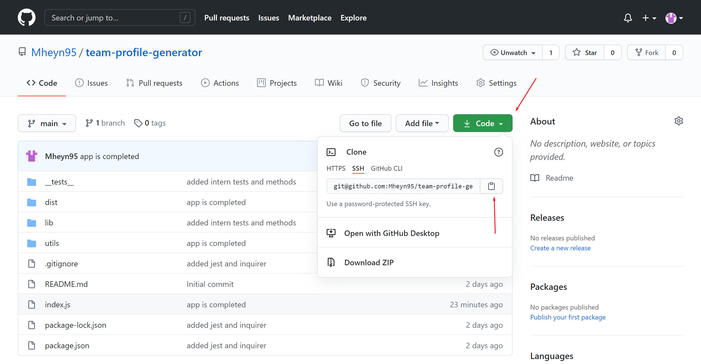
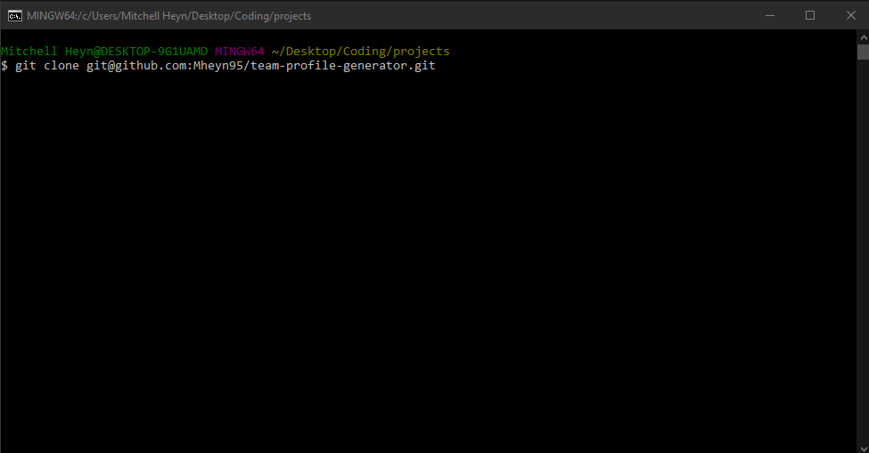
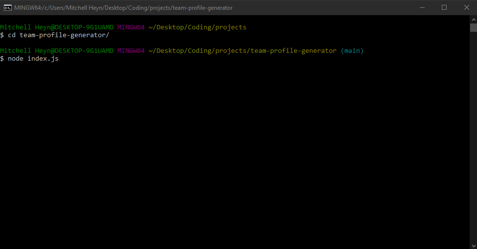

# Team Profile Generator

## License

## Description

This application can be used to generate a professional webpage to showcase members of your team.

## Table of Contents

- [Installation](#installation)
- [Usage](#usage)
- [Test](#test)
- [Questions](#questions)
- [Contributing](#contributing)

## Installation

To install this file navigate to [https://github.com/Mheyn95/team-profile-generator](https://github.com/Mheyn95/team-profile-generator) in a web browser and clone the repository.

Here is an image of GitHub and where you can go to clone the repo.

Here is an image of the command you run in terminal to clone the repo onto your own local machine

## Usage

To use this application go to the directory where you cloned the repository. Once here you can run "node index.js", the application will then run and prompt you for information.

After you are done running the application an HTML file will be created. You can find this file in the "dist" directory, in the parent directory.

Here you can see how you can go to the parent directory using "cd team-profile-generator/" and then run the application by typing "node index.js"!

To watch a video of this application being used follow this link:
[Team Profile Generator Video](https://drive.google.com/file/d/1RuOsHYgjDyp8SU6bGtVLKfYwAUorFUXU/preview)

## Test

In order to test this application you can run "npm test" in the command line in the same location as you would to run the app itself. This will verify all the different employee types are being created. You can also answer the prompts and navigate to "./dist/index.html" and run it in the browser to see if the webpage is generated correctly.

## Questions

- GitHub - [https://github.com/Mheyn95](https://github.com/Mheyn95)
- Email - [mheyn95@gmail.com](mailto:mheyn95@gmail.com)

## Contributing

Mitchell Heyn
